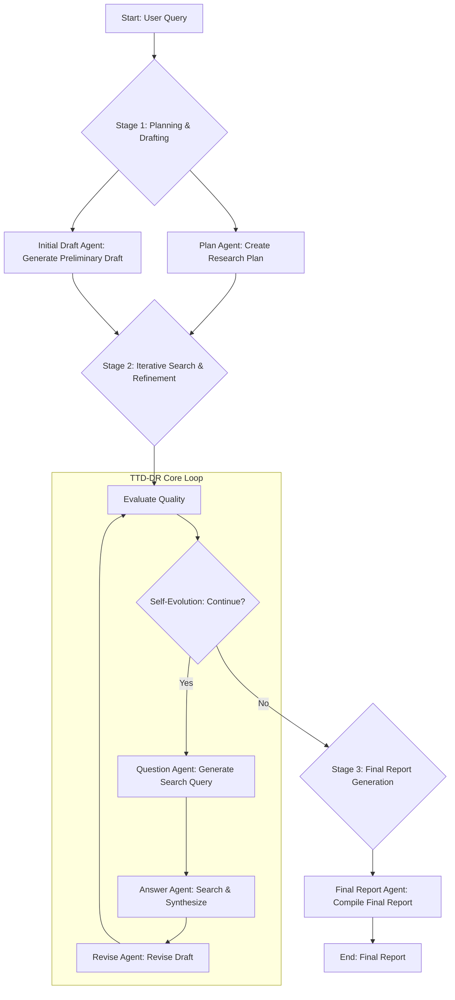

# Test-Time Diffusion Deep Researcher (TTD-DR) Agent

This project is a Python implementation of the "Test-Time Diffusion Deep Researcher" (TTD-DR) concept, utilizing the `strands-agents` SDK. It's an autonomous agent designed to conduct in-depth research on a given query, iteratively refining its findings to produce a comprehensive and coherent final report.

## Background

This implementation is inspired by the research paper:

- **Title:** Deep Researcher with Test-Time Diffusion
- **arXiv URL:** [https://arxiv.org/abs/2507.16075](https://arxiv.org/abs/2507.16075)

The paper introduces a novel framework that conceptualizes research report generation as a diffusion process. The agent starts with a preliminary draft and iteratively refines it through cycles of planning, searching for information, and revision, mimicking the natural workflow of a human researcher.

## Architecture and Relation to the Paper

The core logic of this project directly maps to the concepts proposed in the TTD-DR paper. The agent's workflow is orchestrated by the `TTD_DR_Controller` and can be broken down into the following stages:



**Mapping to the Paper's Concepts:**

-   **Stage 1: Planning & Drafting**: This corresponds to the initial phase of the diffusion process where a preliminary plan and draft are generated based on the user's query.
-   **Stage 2: Iterative Search & Refinement**: This is the core of the TTD-DR framework. The loop of **Evaluation -> Self-Evolution -> Question Generation -> Answering -> Revision** directly implements the paper's concept of "iterative denoising with retrieval." The draft is progressively improved with new information, akin to a diffusion model refining an image.
-   **Self-Evolution**: The `SelfEvolutionManager` in this project (`src/ttd_dr/evolution.py`) makes a decision at each step on whether to continue the refinement process, a key aspect of the autonomous nature of the agent described in the paper.
-   **Stage 3: Final Report Generation**: Once the iterative process concludes, a dedicated agent compiles the final, polished report from the refined draft and all gathered information.

## Key Features

-   **Model-Driven Approach**: Leverages the `strands-agents` SDK to control agent behavior through prompts and tool definitions rather than complex orchestration code.
-   **Advanced Web Search**: Integrates with the Tavily search API via an MCP Server for real-time, relevant information retrieval.
-   **Iterative Refinement**: Improves the quality of the research report through multiple cycles of evaluation and revision.
-   **Autonomous Control**: Automatically decides when to stop the refinement process based on the quality of the current draft.

## Prerequisites

-   Python 3.10+
-   `uv` (Python package installer and virtual environment manager)
-   An AWS account with credentials configured, for access to Amazon Bedrock models.
-   A Tavily API Key for the search functionality.

## Installation and Setup

1.  **Clone the repository:**
    ```bash
    git clone <repository-url>
    cd <repository-directory>
    ```

2.  **Create a virtual environment and install dependencies:**
    ```bash
    # Create the virtual environment
    uv venv

    # Activate the environment
    # On Windows
    .venv\Scripts\activate
    # On macOS/Linux
    source .venv/bin/activate

    # Install dependencies from the lock file
    uv sync
    ```

3.  **Configure your credentials:**
    Create a file named `.env` in the root of the project directory and add your credentials:
    ```env
    # Your AWS profile name (if not using default)
    # AWS_PROFILE=your-profile-name 
    
    # Your Tavily API Key
    TAVILY_API_KEY="your_tavily_api_key"
    ```
    *Note: Ensure your AWS credentials also grant access to the required Bedrock models (e.g., Claude 3.7 Sonnet).*

## How to Use

Run the agent from the command line by providing a research query.

```bash
python -m src.ttd_dr.main "The latest trends in LLM agents"
```

The agent will start the research process, and you will see detailed logs in your console. Once completed, the final report will be saved as a Markdown file in the `output/` directory.

## Project Structure

```
.
├── src/
│   └── ttd_dr/
│       ├── __init__.py
│       ├── agents.py         # Defines all specialized agents
│       ├── controller.py     # Main orchestrator for the TTD-DR workflow
│       ├── evolution.py      # Manages the self-evolution/stopping logic
│       ├── main.py           # Command-line entry point
│       ├── state.py          # Pydantic models for managing state
│       └── tools.py          # Helper functions and tool definitions
├── tests/                    # Unit and integration tests
├── .env.example              # Example environment file
├── pyproject.toml            # Project metadata and dependencies
└── README.md                 # This file
```

## License

This project is licensed under the MIT License. See the `LICENSE` file for details.

## Acknowledgements

This work is a practical implementation based on the concepts presented in the "Deep Researcher with Test-Time Diffusion" paper. We extend our gratitude to the original authors for their insightful research.
