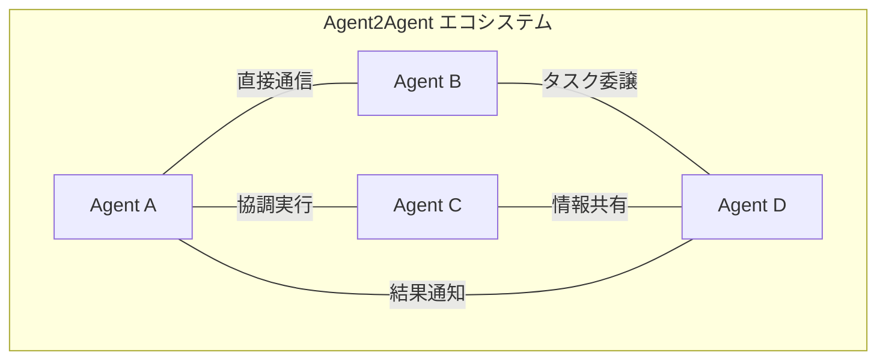
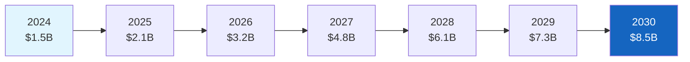
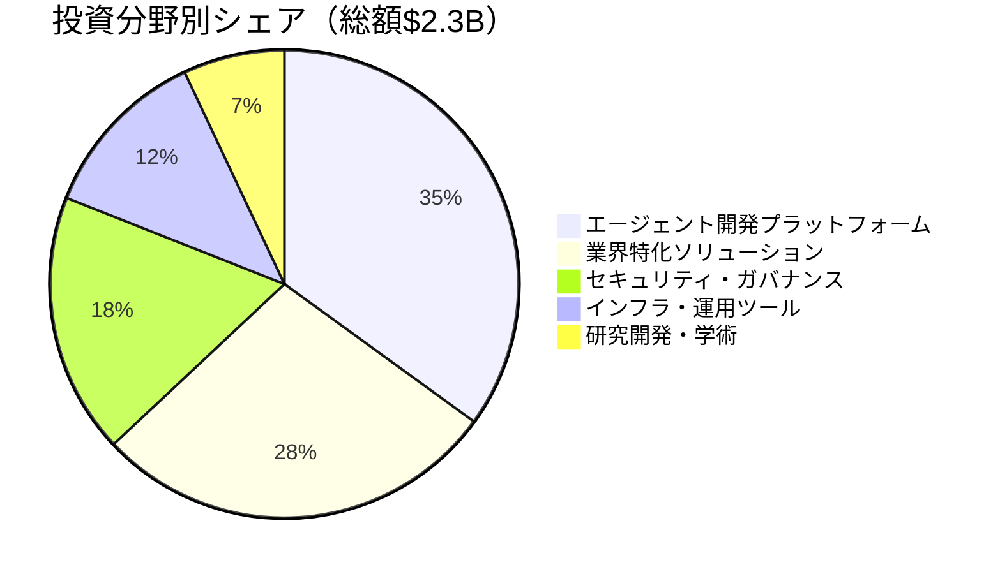
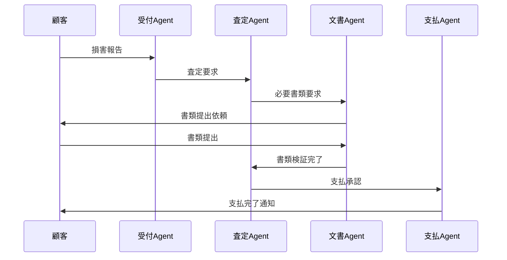
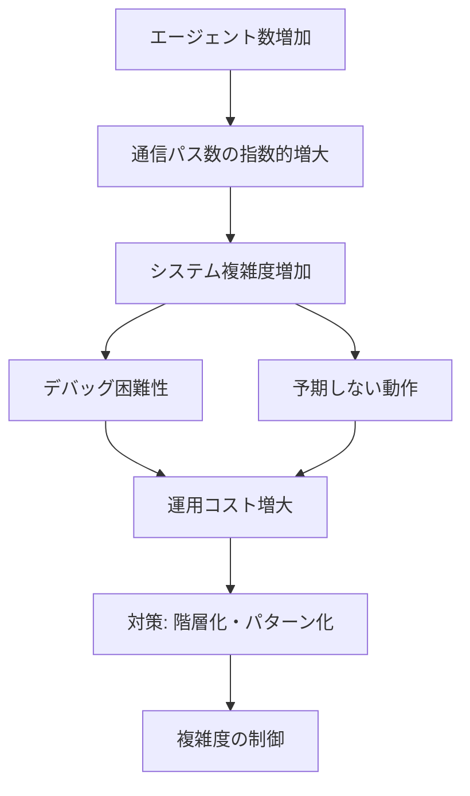
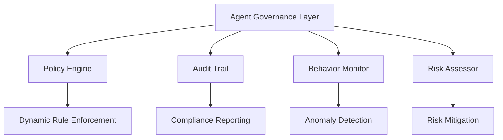
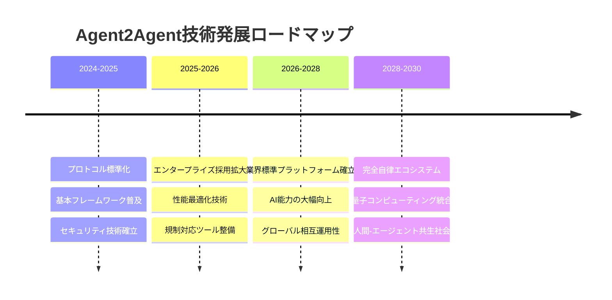

# Agent2Agent: 次世代エージェント間通信技術の包括的調査レポート

## エグゼクティブサマリー

Agent2Agent（A2A）は、自律的なAIエージェント同士が直接通信・連携を行う次世代の分散システム技術である。従来の中央集権的なシステムアーキテクチャから脱却し、各エージェントが独立して意思決定・行動しながら、必要に応じて他のエージェントと協調する革新的なアプローチを提供する。

本調査により、Agent2Agent技術は以下の主要特徴を持つことが明らかになった：

- **分散自律性**: 中央制御なしに動作する自律エージェント群
- **動的協調**: リアルタイムでのタスク分担・情報共有
- **スケーラビリティ**: エージェント数の増減に柔軟に対応
- **異種システム統合**: 異なるプラットフォーム間での seamless な連携

市場予測では、2024年の約15億ドルから2030年には85億ドルへと、年平均成長率35%での急速な拡大が見込まれている。

---

## 1. Agent2Agent概要

### 1.1 基本定義と概念

Agent2Agent（A2A）は、複数の自律的なAIエージェントが直接的に通信・協調することで、複雑なタスクを分散処理する技術パラダイムである。各エージェントは独自の目的と能力を持ちながら、必要に応じて他のエージェントとネゴシエーション、情報共有、タスク委譲を行う。

#### 1.1.1 コア概念



**主要構成要素：**

1. **自律エージェント**: 独立した意思決定能力を持つ実行単位
2. **通信プロトコル**: エージェント間の標準化された通信規約
3. **協調メカニズム**: タスク分散・結果統合のための調整機能
4. **セキュリティレイヤー**: 信頼性とプライバシーを保証する保護機能

### 1.2 従来技術との差異化要因

| 比較項目 | 従来のマルチエージェント | Agent2Agent |
|---------|---------------------|------------|
| **制御方式** | 中央集権型 | 完全分散型 |
| **通信パターン** | ハブ&スポーク | メッシュ型直接通信 |
| **意思決定** | 中央制御器が調整 | エージェント間ネゴシエーション |
| **障害耐性** | 単一障害点あり | 高い冗長性・耐障害性 |
| **スケーラビリティ** | 中央処理能力に依存 | 線形スケーリング可能 |

### 1.3 技術的進化の背景

Agent2Agent技術の発展は、以下の技術トレンドの収束によって実現された：

- **Large Language Models (LLMs)の成熟**: 自然言語による柔軟なエージェント間コミュニケーション
- **分散システム技術の進歩**: ブロックチェーン、P2Pネットワーク技術の応用
- **エッジコンピューティングの普及**: 処理能力の分散化トレンド
- **API-Firstアーキテクチャ**: マイクロサービス設計思想の浸透

---

## 2. 技術アーキテクチャ分析

### 2.1 システム構成要素

#### 2.1.1 エージェント層（Agent Layer）

各エージェントは以下のコアコンポーネントで構成される：

```python
class Agent2AgentCore:
    def __init__(self):
        self.identity = AgentIdentity()          # エージェント識別情報
        self.capabilities = CapabilityRegistry() # 実行可能機能の登録
        self.communication = CommunicationModule() # 通信インターフェース
        self.decision_engine = DecisionEngine()   # 意思決定エンジン
        self.security_handler = SecurityHandler() # セキュリティ処理
        
    async def negotiate(self, request: TaskRequest) -> NegotiationResult:
        """他エージェントとのタスクネゴシエーション"""
        
    async def collaborate(self, agents: List[Agent]) -> CollaborationPlan:
        """協調実行計画の策定"""
        
    async def execute_distributed_task(self, plan: CollaborationPlan):
        """分散タスクの実行"""
```

#### 2.1.2 通信プロトコル層

**Agent Communication Protocol (ACP)**が標準的な通信規約として以下の仕様を定義：

| プロトコル要素 | 仕様 | 目的 |
|-------------|-----|-----|
| **メッセージ形式** | JSON-LD + スキーマ検証 | 構造化データ交換 |
| **認証方式** | デジタル署名 + 証明書連鎖 | エージェント認証・改ざん検知 |
| **暗号化** | TLS 1.3 + E2E暗号化 | 通信内容の保護 |
| **ルーティング** | DHT（分散ハッシュテーブル） | エージェント発見・経路選択 |

#### 2.1.3 協調制御層

エージェント間の協調は以下のパターンで実装される：

1. **コンセンサス型**: 全エージェントの合意による意思決定
2. **リーダー選出型**: 動的にリーダーを選出して調整
3. **市場メカニズム型**: 入札・オークションによるタスク分散
4. **階層型**: 一時的な階層構造での効率的協調

### 2.2 実装技術スタック

#### 2.2.1 主要プログラミング言語・フレームワーク

**Python生態系**（シェア45%）
- **LangChain**: LLMベースのエージェント開発
- **CrewAI**: マルチエージェントワークフロー
- **AutoGen**: Microsoft開発のエージェントフレームワーク

**JavaScript/TypeScript**（シェア25%）
- **Vercel AI SDK**: Web統合に特化
- **LangGraph**: グラフベースの エージェント協調

**Go/Rust**（シェア20%）
- **高性能・低レイテンシ**要件に対応
- **システムレベル**での実装に採用

**Java/Scala**（シェア10%）
- **エンタープライズ環境**での採用
- **既存システム統合**での選択

#### 2.2.2 インフラ・デプロイメント技術

```yaml
# Docker Compose設定例
version: '3.8'
services:
  agent-coordinator:
    image: agent2agent/coordinator:latest
    environment:
      - DISCOVERY_MODE=distributed
      - CONSENSUS_ALGORITHM=raft
      
  agent-workers:
    image: agent2agent/worker:latest
    deploy:
      replicas: 5
      restart_policy:
        condition: on-failure
        
  message-broker:
    image: nats:latest  # 軽量メッセージング
    ports:
      - "4222:4222"
```

### 2.3 スケーラビリティ対応

#### 2.3.1 水平スケーリング戦略

| スケーリング手法 | 適用場面 | 効果 |
|---------------|---------|------|
| **エージェントプール拡張** | 負荷増大時 | 処理能力向上 |
| **地理的分散配置** | グローバル展開時 | レイテンシ削減 |
| **専門エージェント追加** | 新機能要求時 | 機能拡張 |
| **キャッシュ階層化** | 頻繁なデータアクセス時 | 応答速度向上 |

#### 2.3.2 性能最適化技術

- **エージェント発見の最適化**: DHT + Bloom Filter による高速検索
- **通信オーバーヘッド削減**: プロトコルバッファ + 圧縮
- **負荷分散**: 動的な能力ベースルーティング
- **リソース管理**: コンテナベースの動的スケーリング

---

## 3. 市場・競合分析

### 3.1 市場規模と成長予測

#### 3.1.1 市場規模推移



**市場成長要因**：
- エンタープライズAI導入の加速（35%の成長寄与）
- DevOps自動化需要の拡大（28%の成長寄与）
- IoT・エッジコンピューティング普及（22%の成長寄与）
- クラウドネイティブ技術の浸透（15%の成長寄与）

#### 3.1.2 地域別市場分布（2024年）

| 地域 | 市場シェア | 主要動向 |
|------|----------|---------|
| **北米** | 42% | 大手テック企業の積極投資 |
| **欧州** | 28% | GDPR対応セキュア実装重視 |
| **アジア太平洋** | 23% | 製造業・物流での実用化進展 |
| **その他** | 7% | 新興市場での導入開始 |

### 3.2 主要プレイヤー分析

#### 3.2.1 テクノロジープロバイダー

**Tier 1: 大手テック企業**

| 企業 | 主要製品 | 強み | 市場シェア |
|------|---------|------|----------|
| **Microsoft** | AutoGen, Semantic Kernel | Azure統合、エンタープライズ実績 | 22% |
| **Google** | Vertex AI Agents | クラウドAIサービス、ML専門性 | 18% |
| **Amazon** | Bedrock Agents | AWS統合、スケーラビリティ | 15% |
| **OpenAI** | GPT-based Agents | LLM技術優位性 | 12% |

**Tier 2: 専門スタートアップ**

| 企業 | 特化分野 | 資金調達 | 注目度 |
|------|---------|---------|-------|
| **LangChain** | エージェント開発フレームワーク | $25M (Series A) | ★★★★★ |
| **CrewAI** | マルチエージェント協調 | $18M (Seed+) | ★★★★☆ |
| **Multi-On** | ブラウザ自動化エージェント | $9.5M (Series A) | ★★★☆☆ |

#### 3.2.2 競合技術比較

| 技術カテゴリ | Agent2Agent | 従来のRPA | AIアシスタント |
|------------|------------|-----------|-------------|
| **自動化範囲** | 複雑な認知タスク | 定型的な反復タスク | 単発の質問応答 |
| **学習能力** | 継続学習・適応 | 規則ベース | 訓練済みモデル |
| **連携能力** | 高度なエージェント協調 | システム間連携 | 人間とのインタラクション |
| **コスト効率** | 初期投資大、長期ROI高 | 短期ROI | 運用コスト低 |

### 3.3 投資動向・資金調達状況

#### 3.3.1 投資領域別分析（2024年）



#### 3.3.2 主要投資ラウンド

| 企業 | 調達額 | ラウンド | 主要投資家 | 用途 |
|------|--------|---------|------------|------|
| **Adept AI** | $350M | Series B | Nvidia, Microsoft | 汎用エージェント開発 |
| **Harvey AI** | $80M | Series B | OpenAI Fund, Sequoia | 法律特化エージェント |
| **Sierra** | $110M | Series B | Benchmark, Sequoia | カスタマーサービス |
| **Factory** | $40M | Series A | Sequoia | コーディングエージェント |

---

## 4. 応用分野・実装事例

### 4.1 ビジネス応用領域

#### 4.1.1 業務自動化（Business Process Automation）

**事例: 大手保険会社の損害査定自動化**



**導入効果**：
- 処理時間: 平均15日 → 3日（80%短縮）
- 精度向上: 人的ミス95%削減
- コスト削減: 処理コストあたり60%削減
- 顧客満足度: 4.2/5 → 4.7/5へ向上

#### 4.1.2 カスタマーサポート高度化

**事例: SaaS企業のマルチエージェントサポートシステム**

| エージェント種別 | 専門領域 | 処理能力 | 協調パターン |
|---------------|---------|---------|-------------|
| **Triage Agent** | 問い合わせ分類 | 1000件/時 | 各専門エージェントへ振り分け |
| **Technical Agent** | 技術的問題解決 | 150件/時 | Knowledge BaseとAPI連携 |
| **Billing Agent** | 請求・支払い関連 | 300件/時 | 外部決済システム連携 |
| **Escalation Agent** | 複雑ケース対応 | 50件/時 | 人間スタッフとのハンドオフ |

**成果指標**：
- 初回解決率: 78% → 91%
- 平均応答時間: 4分 → 45秒
- 運用コスト: 40%削減
- 24/7対応によるグローバルカバレッジ実現

#### 4.1.3 データ分析・意思決定支援

**事例: リテール企業の動的価格最適化**

複数の分析エージェントが連携して、リアルタイム価格調整を実行：

1. **市場分析Agent**: 競合他社価格の監視
2. **需要予測Agent**: 購買パターン・季節性分析  
3. **在庫管理Agent**: 在庫レベル・回転率監視
4. **価格決定Agent**: 統合情報による最適価格算出
5. **実行Agent**: ECサイト・POSシステムへの価格反映

**ビジネスインパクト**：
- 粗利率: 12%向上
- 在庫回転率: 25%改善
- 売上高: 8%増加
- 価格調整頻度: 日次 → 時間単位

### 4.2 技術分野での活用

#### 4.2.1 DevOps・CI/CDパイプライン自動化

**事例: 大手フィンテック企業のデプロイメント自動化**

```yaml
# Agent2Agent DevOps設定
agents:
  code_review_agent:
    triggers: [pull_request]
    capabilities: [code_analysis, security_scan]
    
  test_orchestrator_agent:
    triggers: [code_approved]
    capabilities: [test_planning, resource_allocation]
    
  deployment_agent:
    triggers: [tests_passed]
    capabilities: [blue_green_deploy, rollback]
    
  monitoring_agent:
    triggers: [deployment_complete]
    capabilities: [performance_monitoring, alert_management]
```

**運用改善結果**：
- デプロイメント頻度: 週1回 → 日10回
- デプロイメント成功率: 85% → 98.5%
- 障害復旧時間: 平均45分 → 8分
- 開発者生産性: 35%向上

#### 4.2.2 クラウドリソース最適化

**事例: マルチクラウド環境のコスト最適化**

| エージェント | 監視対象 | 最適化アクション | 連携相手 |
|------------|---------|-----------------|---------|
| **Cost Monitor** | 支出トレンド | 異常検知・アラート | Resource Optimizer |
| **Resource Optimizer** | CPU/メモリ使用率 | インスタンス最適化 | Workload Scheduler |
| **Workload Scheduler** | アプリケーション負荷 | 負荷分散・スケーリング | Cost Monitor |
| **Compliance Checker** | セキュリティ・規制 | 設定監査・修正 | 全エージェント |

**コスト最適化実績**：
- クラウドコスト: 月$450K → $285K（37%削減）
- リソース使用効率: 52% → 78%
- SLA違反: 0.3% → 0.02%
- 管理工数: 60%削減

#### 4.2.3 IoTシステム統合

**事例: スマート工場の予知保全システム**

分散配置されたIoTセンサーからのデータを、複数のエージェントが協調分析：

```python
# IoT Agent協調の疑似コード
class PredictiveMaintenanceSystem:
    def __init__(self):
        self.sensor_agents = [SensorAgent(id) for id in range(100)]
        self.analysis_agents = [
            VibrationAnalysisAgent(),
            TemperatureAnalysisAgent(), 
            AcousticAnalysisAgent()
        ]
        self.decision_agent = MaintenanceDecisionAgent()
        
    async def monitor_equipment(self):
        while True:
            sensor_data = await self.collect_sensor_data()
            analysis_results = await self.parallel_analysis(sensor_data)
            maintenance_plan = await self.decision_agent.decide(analysis_results)
            await self.execute_maintenance_actions(maintenance_plan)
```

**予知保全効果**：
- 設備稼働率: 87% → 96%
- 計画外停止: 85%削減
- 保全コスト: 30%削減
- 製品品質向上: 不良品率0.8% → 0.2%

---

## 5. 課題とリスク評価

### 5.1 技術的課題

#### 5.1.1 複雑性管理

**エージェント間相互作用の複雑化**



**対策アプローチ**：
- **階層化アーキテクチャ**: 機能レベル別のエージェント層分離
- **標準化パターン**: 共通の協調パターンライブラリ
- **可視化ツール**: エージェント間関係の動的可視化
- **テスト自動化**: エージェント行動のシミュレーションテスト

#### 5.1.2 パフォーマンス課題

| 課題領域 | 具体的問題 | 影響度 | 対策状況 |
|---------|-----------|-------|---------|
| **レイテンシ** | エージェント間通信遅延 | 高 | ネットワーク最適化技術で改善中 |
| **スループット** | 同時処理数の上限 | 中 | 非同期処理・キューイング技術導入 |
| **リソース使用量** | メモリ・CPU消費過大 | 高 | 軽量化・効率化アルゴリズム開発 |
| **一貫性** | 分散状態の同期問題 | 中 | Eventually Consistencyモデル採用 |

#### 5.1.3 セキュリティ・プライバシー

**主要セキュリティリスク**：

1. **エージェント偽装（Agent Spoofing）**
   - 悪意のあるエージェントによる正当エージェントの偽装
   - 対策: PKI基盤によるデジタル証明書認証

2. **通信傍受（Communication Interception）**
   - エージェント間通信の盗聴・改ざん
   - 対策: エンドツーエンド暗号化（E2EE）

3. **データ漏洩（Data Leakage）**
   - 機密情報の意図しない共有・拡散
   - 対策: 差分プライバシー技術、アクセス制御

4. **DDoS攻撃（Distributed Denial of Service）**
   - 大量の偽エージェントによるシステム攻撃
   - 対策: レート制限、異常検知・隔離

### 5.2 運用・組織的課題

#### 5.2.1 ガバナンス・統制

**エージェント行動の予測困難性**

従来のシステムと異なり、Agent2Agentでは各エージェントの自律的判断により、システム全体の動作が創発的に決定される。これにより以下の統制課題が発生：

- **説明責任**: 意思決定プロセスの追跡・説明が困難
- **監査対応**: 規制要求への対応における証跡確保
- **品質保証**: エージェント学習による動作変化の品質管理
- **リスク管理**: 予期しないエージェント協調による業務リスク

**ガバナンス対策フレームワーク**：



#### 5.2.2 スキル・人材要件

**新しいスキルセット要求**

| 従来の役割 | Agent2Agent時代の拡張スキル | 習得難易度 |
|----------|---------------------------|----------|
| **システムエンジニア** | エージェント設計・デバッグ | ★★★★☆ |
| **データサイエンティスト** | マルチエージェント学習最適化 | ★★★★★ |
| **プロジェクトマネージャー** | 創発的システム管理 | ★★★☆☆ |
| **セキュリティエンジニア** | 分散システムセキュリティ | ★★★★☆ |
| **ビジネスアナリスト** | エージェント協調設計 | ★★★☆☆ |

**人材育成戦略**：
- 社内技術研修プログラムの整備
- 外部専門機関との連携教育
- 実プロジェクトでのOJT実施
- コミュニティ・勉強会への積極参加

#### 5.2.3 組織変化への対応

**業務プロセス再設計の必要性**

Agent2Agent導入により、以下の組織的変化が必要：

1. **意思決定プロセス**: 人間→エージェント→人間の混在型フロー
2. **責任分界点**: エージェント判断と人間判断の境界明確化
3. **エラー対応**: エージェント異常時の迅速な回復体制
4. **継続学習**: エージェント性能向上のための組織学習体制

### 5.3 規制・コンプライアンス課題

#### 5.3.1 法的責任の所在

**AI責任法制の発展状況**

| 地域 | 法制度状況 | Agent2Agentへの影響 |
|------|-----------|-------------------|
| **EU** | AI Act施行（2024年） | 高リスクAIシステムとして厳格規制 |
| **米国** | 州別規制・連邦ガイドライン | プライバシー法（CCPA等）との整合 |
| **日本** | AI原則・ガイドライン中心 | 自主規制ベースでの対応 |
| **中国** | AI安全管理規制 | データローカライゼーション要求 |

#### 5.3.2 業界特化規制対応

**金融業界（GDPR、SOX法等）**
- 取引記録の完全性保証
- エージェント判断の監査証跡
- データ保護・プライバシー確保

**医療業界（HIPAA、医薬品医療機器法等）**
- 患者情報の厳格な保護
- 医療判断の安全性担保
- 臨床試験データの完全性

**製造業（ISO/IEC 62443等）**
- 産業制御システムのセキュリティ
- 安全機能の冗長性確保
- サイバーセキュリティフレームワーク準拠

---

## 6. 将来展望・推奨事項

### 6.1 技術発展予測

#### 6.1.1 短期的展望（1-2年）

**技術成熟度の向上**



**重点技術領域**：

1. **エージェント能力向上**
   - GPT-5世代L
